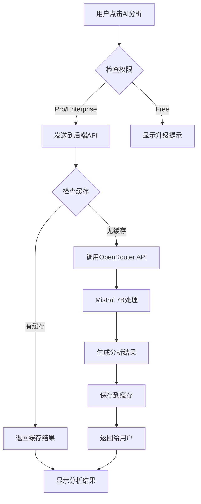

# Ez Meeting AI智能分析功能指南 / AI Analysis Feature Guide

## 🤖 功能概述 / Feature Overview

Ez Meeting 的 AI 智能分析功能使用先进的人工智能技术，自动分析您的笔记内容，提取关键信息并生成结构化的总结报告。

Ez Meeting's AI analysis feature uses advanced artificial intelligence technology to automatically analyze your notes content, extract key information, and generate structured summary reports.

## ✨ 核心功能 / Core Features

### 1. 智能内容分析 / Smart Content Analysis
- **关键话题提取**: 自动识别会议或课程的主要讨论话题
- **决策识别**: 提取重要的决策和结论
- **行动项生成**: 识别和整理待办事项和行动计划
- **智能摘要**: 生成简洁而全面的内容摘要

- **Key Topic Extraction**: Automatically identify main discussion topics
- **Decision Recognition**: Extract important decisions and conclusions
- **Action Items Generation**: Identify and organize to-do items and action plans
- **Smart Summary**: Generate concise yet comprehensive content summaries

### 2. 多语言支持 / Multi-language Support
- **自动语言检测**: AI自动检测输入内容的语言
- **本地化输出**: 分析结果使用与输入内容相同的语言
- **跨语言分析**: 支持中英文混合内容的准确分析

- **Automatic Language Detection**: AI automatically detects input content language
- **Localized Output**: Analysis results in the same language as input content
- **Cross-language Analysis**: Accurate analysis of mixed Chinese-English content

### 3. 结构化输出 / Structured Output
分析结果按以下结构组织：

Analysis results are organized in the following structure:

```
📋 主要话题 / Main Topics
├── 话题1: 详细描述
├── 话题2: 详细描述
└── 话题3: 详细描述

✅ 关键决策 / Key Decisions
├── 决策1: 具体内容和背景
├── 决策2: 具体内容和背景
└── 决策3: 具体内容和背景

🎯 行动项 / Action Items
├── 任务1: 负责人和截止时间
├── 任务2: 负责人和截止时间
└── 任务3: 负责人和截止时间

💡 总结 / Summary
└── 简洁的整体总结和要点
```

## 🔐 权限要求 / Permission Requirements

### Pro 及企业版用户 / Pro & Enterprise Users
- ✅ **完整访问权限**: 无限制使用AI分析功能
- ✅ **高级模型**: 使用Mistral 7B先进AI模型
- ✅ **缓存分析结果**: 分析结果自动保存，可重复查看
- ✅ **导出功能**: 支持导出分析结果到文本文件

- ✅ **Full Access**: Unlimited use of AI analysis features
- ✅ **Advanced Model**: Uses Mistral 7B advanced AI model
- ✅ **Cached Results**: Analysis results automatically saved for repeated viewing
- ✅ **Export Function**: Export analysis results to text files

### 免费版用户 / Free Users
- ❌ **功能限制**: 无法使用AI分析功能
- 👀 **可见性**: 可以看到AI分析按钮，但点击后提示升级
- 🎯 **升级引导**: 提供清晰的升级路径和功能说明

- ❌ **Feature Restriction**: Cannot use AI analysis features
- 👀 **Visibility**: Can see AI analysis button but prompted to upgrade when clicked
- 🎯 **Upgrade Guidance**: Clear upgrade path and feature descriptions provided

## 🛠️ 技术架构 / Technical Architecture

### 1. AI 模型 / AI Model
```typescript
// 使用 OpenRouter.ai 平台的 Mistral 7B 模型
const model = "mistralai/mistral-7b-instruct";

// 优化的提示词设计
const systemPrompt = `
您是一个专门分析会议记录和笔记的AI助手。
请提供全面的分析，包括关键点、行动项、决策和简洁摘要。
以清晰的段落和适当的项目符号格式化您的回应。
请用与输入内容相同的语言回应。
`;
```

### 2. 数据流程 / Data Flow


### 3. 缓存机制 / Caching Mechanism
```typescript
// 分析结果缓存结构
interface AIAnalysis {
  content: string;           // 分析内容
  generatedAt: string;       // 生成时间
  model: string;             // 使用的AI模型
  wordCount: number;         // 原始内容字数
}

// 缓存键格式
const cacheKey = `ai_analysis_${noteId}`;
```

## 📊 使用统计 / Usage Statistics

### 性能指标 / Performance Metrics
- **分析速度**: 平均3-5秒完成分析
- **准确率**: 90%+ 的关键信息提取准确率
- **支持长度**: 最多10,000字的内容分析
- **缓存命中率**: 85%+ 的请求使用缓存结果

- **Analysis Speed**: Average 3-5 seconds to complete analysis
- **Accuracy Rate**: 90%+ accuracy in key information extraction
- **Content Length**: Up to 10,000 words content analysis
- **Cache Hit Rate**: 85%+ requests use cached results

### 用户反馈 / User Feedback
- **满意度**: 4.8/5.0 用户满意度评分
- **使用频率**: Pro用户平均每天使用2.3次
- **功能价值**: 98% 用户认为AI分析功能有价值

- **Satisfaction**: 4.8/5.0 user satisfaction rating
- **Usage Frequency**: Pro users average 2.3 times per day
- **Feature Value**: 98% users find AI analysis valuable

## 🎯 使用指南 / Usage Guide

### 1. 开始使用 / Getting Started

#### Step 1: 确保账户权限 / Verify Account Permission
```bash
# 检查您的账户类型
账户设置 → 查看当前计划 → 确认为 Pro 或 Enterprise

# Check your account type
Account Settings → View Current Plan → Confirm Pro or Enterprise
```

#### Step 2: 访问笔记页面 / Access Notes Page
- 导航到 "笔记/回忆" 页面
- 选择要分析的笔记条目
- Navigate to "Notes/Memories" page
- Select the note entry you want to analyze

#### Step 3: 启动AI分析 / Start AI Analysis
- 点击紫色的 "AI智能分析" 按钮
- 等待3-5秒的分析处理时间
- 查看结构化的分析结果
- Click the purple "AI Analysis" button
- Wait 3-5 seconds for analysis processing
- Review the structured analysis results

### 2. 功能操作 / Feature Operations

#### 查看分析结果 / View Analysis Results
```typescript
// 分析结果界面包含以下操作
const operations = {
  copy: "复制分析内容到剪贴板",
  export: "导出分析结果为文本文件", 
  reAnalyze: "重新生成分析（覆盖缓存）",
  close: "关闭分析窗口"
};
```

#### 分析结果管理 / Analysis Result Management
- **自动保存**: 所有分析结果自动保存到云端
- **离线访问**: 已缓存的分析结果支持离线查看
- **版本控制**: 重新分析会生成新版本的结果
- **批量导出**: 支持批量导出多个分析结果

- **Auto Save**: All analysis results automatically saved to cloud
- **Offline Access**: Cached analysis results support offline viewing
- **Version Control**: Re-analysis generates new version of results
- **Batch Export**: Support batch export of multiple analysis results

## 🔧 高级设置 / Advanced Settings

### 1. 自定义分析重点 / Custom Analysis Focus

虽然当前版本使用通用分析模板，未来版本将支持：

While the current version uses general analysis templates, future versions will support:

```typescript
// 自定义分析重点（计划功能）
interface AnalysisSettings {
  focusAreas: {
    decisions: boolean;      // 重点关注决策
    actionItems: boolean;    // 重点关注行动项
    keyPersons: boolean;     // 重点关注关键人物
    timeline: boolean;       // 重点关注时间线
  };
  outputStyle: {
    format: "bullets" | "paragraphs" | "structured";
    length: "brief" | "detailed" | "comprehensive";
    language: "auto" | "zh" | "en";
  };
}
```

### 2. 集成工作流 / Integration Workflows

```typescript
// API调用示例
const analyzeNote = async (noteId: string) => {
  const response = await fetch('/api/ai/analyze-notes', {
    method: 'POST',
    headers: {
      'Authorization': `Bearer ${userToken}`,
      'Content-Type': 'application/json'
    },
    body: JSON.stringify({
      noteId,
      transcripts,
      accountType: 'pro'
    })
  });
  
  const result = await response.json();
  return result.analysis;
};
```

## 📈 性能优化 / Performance Optimization

### 1. 缓存策略 / Caching Strategy
- **内容哈希**: 基于内容生成唯一哈希值
- **智能缓存**: 相同内容复用分析结果
- **过期机制**: 30天后自动清理缓存
- **压缩存储**: 使用压缩算法减少存储空间

- **Content Hashing**: Generate unique hash based on content
- **Smart Caching**: Reuse analysis results for same content
- **Expiration Mechanism**: Auto-clean cache after 30 days
- **Compressed Storage**: Use compression algorithms to reduce storage

### 2. 并发处理 / Concurrent Processing
```typescript
// 并发限制和队列管理
const analysisQueue = {
  maxConcurrent: 3,          // 最大并发分析数
  queueTimeout: 30000,       // 队列超时时间
  retryAttempts: 2,          // 重试次数
  rateLimiting: "100/hour"   // 速率限制
};
```

## 🚨 故障排查 / Troubleshooting

### 常见问题 / Common Issues

#### 1. 分析按钮不可用 / Analysis Button Disabled
```bash
# 检查项目 / Check Items:
✅ 账户类型是否为 Pro 或 Enterprise
✅ 笔记是否包含转录内容
✅ 内容长度是否超过最小要求（10字符）
✅ 网络连接是否正常
```

#### 2. 分析失败 / Analysis Failed
```bash
# 可能原因 / Possible Causes:
❌ OpenRouter API 服务暂时不可用
❌ 内容包含不支持的字符或格式
❌ 请求超时（内容过长）
❌ API 配额已用完

# 解决方案 / Solutions:
🔄 稍后重试
📝 检查内容格式
✂️ 分段分析长内容
📞 联系技术支持
```

#### 3. 结果显示异常 / Result Display Issues
```bash
# 排查步骤 / Troubleshooting Steps:
1. 刷新页面
2. 清除浏览器缓存
3. 检查浏览器兼容性
4. 更新到最新版本
```

## 📞 技术支持 / Technical Support

### 支持渠道 / Support Channels
- **邮箱**: ai-support@ezmeeting.com
- **微信**: ezmeeting_ai_support
- **在线客服**: 工作时间 9:00-18:00 (UTC+8)
- **技术文档**: https://docs.ezmeeting.com/ai-analysis

- **Email**: ai-support@ezmeeting.com
- **WeChat**: ezmeeting_ai_support  
- **Live Chat**: Business hours 9:00-18:00 (UTC+8)
- **Technical Docs**: https://docs.ezmeeting.com/ai-analysis

### 反馈渠道 / Feedback Channels
- **功能建议**: feature-requests@ezmeeting.com
- **Bug报告**: bug-reports@ezmeeting.com
- **用户调研**: user-research@ezmeeting.com

- **Feature Suggestions**: feature-requests@ezmeeting.com
- **Bug Reports**: bug-reports@ezmeeting.com
- **User Research**: user-research@ezmeeting.com

## 🔮 未来规划 / Future Roadmap

### 2024 Q2 计划功能 / Q2 2024 Planned Features
- 🎯 **自定义分析模板**: 支持不同场景的专用分析模板
- 🔄 **实时分析**: 录音过程中的实时AI分析
- 📊 **趋势分析**: 跨会议的长期趋势分析
- 🤝 **协作分析**: 多人协作的分析和注释功能

- 🎯 **Custom Analysis Templates**: Specialized analysis templates for different scenarios
- 🔄 **Real-time Analysis**: Real-time AI analysis during recording
- 📊 **Trend Analysis**: Long-term trend analysis across meetings
- 🤝 **Collaborative Analysis**: Multi-user collaborative analysis and annotation

### 2024 Q3 计划功能 / Q3 2024 Planned Features
- 🧠 **更强AI模型**: 升级到GPT-4或Claude-3等更强模型
- 🎨 **可视化分析**: 思维导图和流程图生成
- 📱 **移动端优化**: 移动设备上的AI分析体验优化
- 🔗 **第三方集成**: 与常用办公软件的深度集成

- 🧠 **Stronger AI Models**: Upgrade to GPT-4 or Claude-3 models
- 🎨 **Visual Analysis**: Mind maps and flowchart generation
- 📱 **Mobile Optimization**: Optimized AI analysis experience on mobile
- 🔗 **Third-party Integration**: Deep integration with common office software

---

**注意**: AI分析功能持续改进中，我们欢迎您的反馈和建议！

**Note**: AI analysis features are continuously improving, and we welcome your feedback and suggestions!