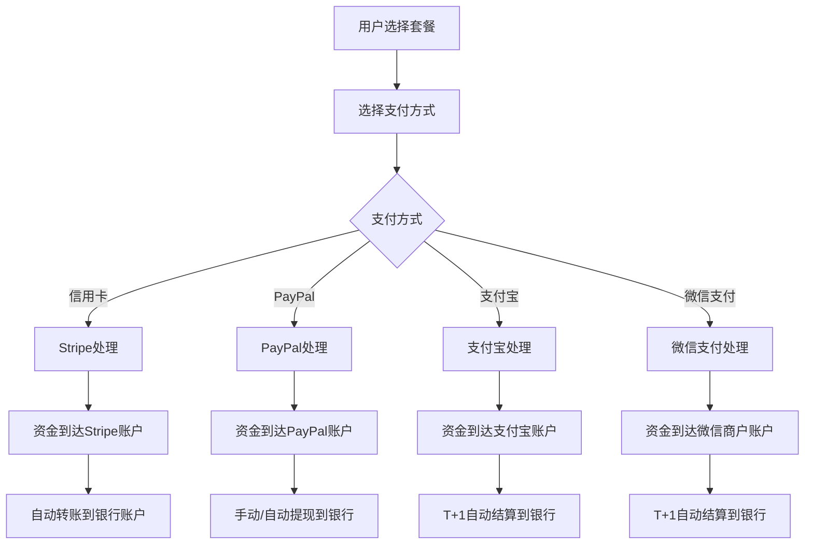

# Ez Meeting 收款配置完整指南 / Complete Payment Setup Guide

## 🚀 快速开始 / Quick Start

Ez Meeting 的收款配置功能让超级管理员可以设置多种支付方式的收款账户，实现自动化的资金管理。

The payment configuration feature in Ez Meeting allows super administrators to set up various payment method accounts for automated fund management.

## 📋 前置要求 / Prerequisites

### 1. 超级管理员权限 / Super Administrator Access
- 只有超级管理员可以访问"收款配置"功能
- 确保您的账户具有 `super_admin` 角色

### 2. 支付服务商账户 / Payment Provider Accounts
在配置前，您需要先注册以下服务商账户：

Before configuration, you need to register accounts with the following providers:

#### 🏦 国际支付 / International Payments
- **Stripe**: https://stripe.com (推荐用于全球收款)
- **PayPal**: https://paypal.com (适合个人和小企业)

#### 🏪 中国市场 / Chinese Market
- **支付宝开放平台**: https://open.alipay.com
- **微信支付商户平台**: https://pay.weixin.qq.com

## 🔧 配置步骤 / Configuration Steps

### Step 1: 登录管理后台 / Login to Admin Panel

1. 以超级管理员身份登录 Ez Meeting
2. 点击顶部导航的"管理"菜单
3. 进入"收款配置"标签页

### Step 2: Stripe 配置 / Stripe Configuration

#### 2.1 获取 Stripe API 密钥 / Get Stripe API Keys

```bash
# 登录 Stripe Dashboard
# 1. 访问 https://dashboard.stripe.com
# 2. 进入 "开发者" > "API 密钥"
# 3. 复制以下密钥：

可发布密钥 (Publishable Key): pk_live_xxx 或 pk_test_xxx
密钥 (Secret Key): sk_live_xxx 或 sk_test_xxx
```

#### 2.2 设置 Webhook / Setup Webhook

```bash
# Webhook URL 格式：
https://your-domain.supabase.co/functions/v1/make-server-851310fa/payment/webhook

# 监听事件：
- payment_intent.succeeded
- payment_intent.payment_failed
- invoice.payment_succeeded
- customer.subscription.updated
```

#### 2.3 Ez Meeting 中的配置 / Configuration in Ez Meeting

1. 启用 Stripe 开关
2. 填入可发布密钥 (Publishable Key)
3. 填入私钥 (Secret Key) - 系统会自动隐藏显示
4. 填入 Webhook 密钥 (从 Stripe Dashboard 获取)
5. （可选）填入账户 ID (用于连接账户)

### Step 3: PayPal 配置 / PayPal Configuration

#### 3.1 创建 PayPal 应用 / Create PayPal App

```bash
# 1. 登录 PayPal 开发者控制台
# 访问：https://developer.paypal.com

# 2. 创建新应用
# 选择："Default Application" 或创建新应用

# 3. 获取凭据
Client ID: 应用的客户端 ID
Client Secret: 应用的客户端密钥
```

#### 3.2 Ez Meeting 中的配置 / Configuration in Ez Meeting

1. 启用 PayPal 开关
2. 填入客户端 ID (Client ID)
3. 填入客户端密钥 (Client Secret)
4. 选择运行模式：
   - `sandbox`: 测试环境
   - `live`: 生产环境
5. （可选）配置 Webhook ID

### Step 4: 支付宝配置 / Alipay Configuration

#### 4.1 创建支付宝应用 / Create Alipay App

```bash
# 1. 登录支付宝开放平台
# 访问：https://open.alipay.com

# 2. 创建应用
# 选择："网页&移动应用"

# 3. 获取配置信息
APPID: 应用的唯一标识
应用私钥: 用于签名的RSA私钥  
支付宝公钥: 用于验签的支付宝RSA公钥
合作伙伴ID: 商户的合作伙伴身份ID
```

#### 4.2 生成 RSA 密钥对 / Generate RSA Key Pair

```bash
# 使用支付宝提供的密钥生成工具
# 下载地址：https://opendocs.alipay.com/common/02kipl

# 生成后会得到：
# 1. 应用私钥 (用于签名)
# 2. 应用公钥 (上传到支付宝后台)
```

### Step 5: 微信支付配置 / WeChat Pay Configuration

#### 5.1 申请微信支付 / Apply for WeChat Pay

```bash
# 1. 访问微信支付商户平台
# 网址：https://pay.weixin.qq.com

# 2. 申请商户号
# 需要提供营业执照等资质文件

# 3. 获取配置信息
APPID: 微信公众号/小程序的AppID
商户号 (MCH_ID): 微信支付分配的商户号
API密钥 (API_KEY): 商户密钥，用于签名
证书文件: 用于API安全调用的证书
```

### Step 6: 银行账户配置 / Bank Account Configuration

#### 6.1 国内银行账户 / Domestic Bank Account

```bash
# 中国大陆银行账户信息
账户名称: 与营业执照一致的账户名
银行名称: 开户银行全称
账户号码: 银行账户号
开户行号: 银行联行号（用于跨行转账）
```

#### 6.2 国际银行账户 / International Bank Account

```bash
# 国际银行账户信息
Account Name: 账户持有人姓名
Bank Name: 银行名称
Account Number: 账户号码
Routing Number: 美国银行路由号
SWIFT Code: 国际银行代码
Country: 银行所在国家
```

### Step 7: 税务设置 / Tax Settings

#### 7.1 中国税务 / Chinese Tax

```bash
# 中国增值税信息
纳税人识别号: 营业执照上的统一社会信用代码
税务登记号: 税务局分配的登记号
营业地址: 营业执照上的注册地址
默认税率: 6% (增值税率，根据业务类型调整)
```

#### 7.2 国际税务 / International Tax

```bash
# 国际税务信息
VAT Number: 欧盟增值税号
Tax ID: 美国联邦税号 (EIN)
Business Address: 营业地址
Default Tax Rate: 根据当地税法设置
```

## 💰 收款流程 / Payment Flow

### 自动化收款流程 / Automated Payment Flow



## 🔒 安全最佳实践 / Security Best Practices

### 1. API 密钥管理 / API Key Management

```bash
# ✅ 正确做法
- 使用强密码保护管理员账户
- 定期轮换 API 密钥
- 使用生产环境密钥（而非测试密钥）
- 设置IP白名单限制访问

# ❌ 避免事项
- 不要在代码中硬编码密钥
- 不要与第三方分享密钥
- 不要在不安全的网络中操作
- 不要截图包含密钥的页面
```

### 2. Webhook 安全 / Webhook Security

```bash
# Webhook 验证示例
# Stripe Webhook 验证
const signature = request.headers['stripe-signature'];
const event = stripe.webhooks.constructEvent(body, signature, webhookSecret);

# PayPal Webhook 验证  
const isValid = paypal.notification.webhookSignature.verify(headers, body, webhookId);
```

### 3. 数据加密 / Data Encryption

```bash
# 敏感数据加密存储
- API 密钥使用 AES-256 加密
- 银行账户信息使用单独加密
- 定期备份加密数据
- 实施访问日志记录
```

## 📊 收入管理 / Revenue Management

### 1. 自动对账 / Automatic Reconciliation

```typescript
// 每日自动对账流程
const dailyReconciliation = async () => {
  // 1. 获取所有支付记录
  const payments = await getPaymentsFromProviders();
  
  // 2. 与系统订单匹配
  const matchedOrders = await matchPaymentsWithOrders(payments);
  
  // 3. 生成对账报告
  const report = generateReconciliationReport(matchedOrders);
  
  // 4. 发送给财务团队
  await sendReportToFinance(report);
};
```

### 2. 多币种管理 / Multi-Currency Management

```typescript
// 汇率管理
const exchangeRates = {
  'USD_TO_CNY': 7.2,
  'EUR_TO_CNY': 7.8,
  'GBP_TO_CNY': 8.9
};

// 收入统计
const calculateRevenue = (payments) => {
  return payments.reduce((total, payment) => {
    const cnyAmount = convertToCNY(payment.amount, payment.currency);
    return total + cnyAmount;
  }, 0);
};
```

## 🎯 常见问题 / FAQ

### Q1: 如何选择合适的支付方式？

**A**: 根据目标市场选择：
- **全球市场**: Stripe (手续费2.9% + $0.30)
- **欧美市场**: PayPal (手续费2.9% + 固定费用)
- **中国市场**: 支付宝 + 微信支付 (手续费0.6%)

### Q2: 资金多久能到账？

**A**: 到账时间因支付方式而异：
- **Stripe**: 2-7个工作日
- **PayPal**: 即时到PayPal余额，提现1-3个工作日
- **支付宝/微信**: T+1工作日

### Q3: 如何处理退款？

**A**: 退款流程：
1. 用户申请退款
2. 管理员在后台审核
3. 通过原支付方式原路退回
4. 更新用户账户状态

### Q4: 税务如何处理？

**A**: 税务处理建议：
- 根据当地税法设置税率
- 定期生成税务报告
- 咨询专业税务顾问
- 保留完整的交易记录

## 🛠️ 故障排查 / Troubleshooting

### 1. Stripe 连接失败

```bash
# 检查项目
✅ API 密钥是否正确
✅ 是否使用了正确环境的密钥 (live/test)
✅ 网络连接是否正常
✅ Webhook URL 是否可访问
```

### 2. PayPal 支付失败

```bash
# 检查项目  
✅ 客户端ID和密钥是否匹配
✅ 运行模式设置是否正确
✅ PayPal账户是否已验证
✅ 支付金额是否在限额内
```

### 3. 支付宝/微信支付问题

```bash
# 检查项目
✅ 应用是否已上线
✅ RSA密钥对是否正确配置
✅ 签名算法是否正确
✅ 商户资质是否完整
```

## 📞 技术支持 / Technical Support

### 支付服务商技术支持 / Provider Support

- **Stripe支持**: https://support.stripe.com
- **PayPal支持**: https://developer.paypal.com/support
- **支付宝支持**: https://opendocs.alipay.com
- **微信支付支持**: https://pay.weixin.qq.com/wiki

### Ez Meeting 技术支持 / Ez Meeting Support

- **邮箱**: support@ezmeeting.com
- **微信**: ezmeeting_support
- **QQ群**: 123456789
- **工作时间**: 周一至周五 9:00-18:00 (UTC+8)

## 🔄 更新日志 / Update Log

### v1.0.0 (2024-01-15)
- ✅ 基础收款配置功能
- ✅ Stripe集成
- ✅ PayPal集成
- ✅ 多币种支持

### v1.1.0 (2024-02-01)
- ✅ 支付宝集成
- ✅ 微信支付集成
- ✅ 银行账户配置
- ✅ 税务设置

### v1.2.0 (2024-03-01)
- ✅ 自动对账功能
- ✅ 收入报告
- ✅ 多语言支持
- ✅ 安全增强

---

**注意**: 请确保在生产环境使用前充分测试所有支付流程，并遵守当地的金融法规要求。

**Note**: Please ensure thorough testing of all payment flows before production use and comply with local financial regulations.